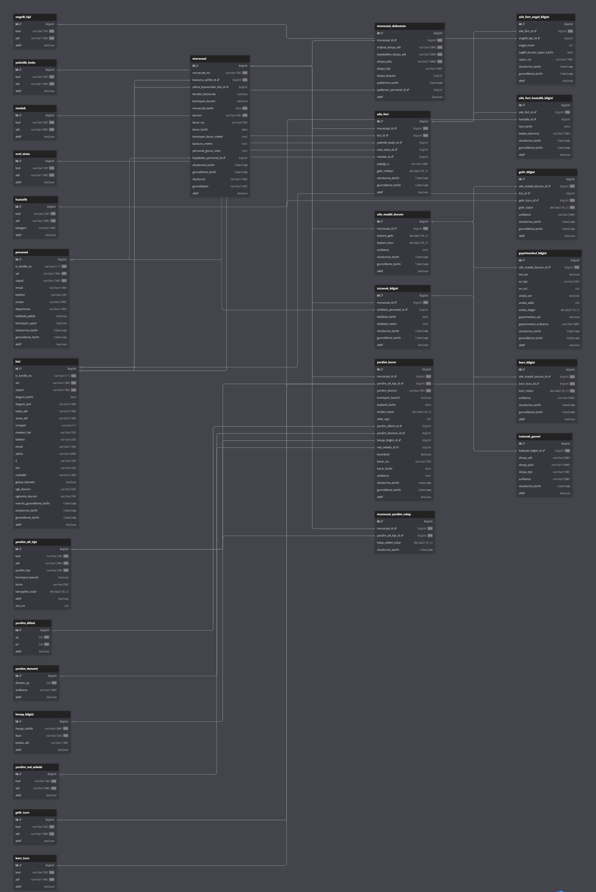

# Sosyal Yardım Bilgi Sistemi (SAIS)


Sosyal yardım müracaatlarının takip ve yönetimi için geliştirilmiş kurumsal web uygulaması.


## 🎯 Genel Bakış

### Ana Modüller

1. **Müracaat Yönetimi** - Başvuru kayıt ve takip
2. **Aile Fertleri** - Başvuru sahibi ve aile üyelerinin bilgileri
3. **Maddi Durum** - Gelir-gider-varlık takibi
4. **Tutanak/Tahkikat** - Saha çalışması ve evrak yönetimi
5. **Yardım Kararları** - Komisyon kararları ve onay süreci
6. **Raporlama** - PDF çıktılar


## 🛠 Teknoloji Stack

### Backend
- **Spring Boot 3.2.0** 
- **Spring Data JPA** 
- **Hibernate 6.4.x** 
- **MapStruct 1.6.3** 
- **Lombok 1.18.30** 

### Frontend
- **JSF 4.0 (Mojarra)** 
- **PrimeFaces 13.0.0** 
- **OmniFaces 4.4.1** 
- **JoinFaces 5.3.3** 

### Veritabanı
- **Oracle Database 19c** 
- **Oracle JDBC Driver 19.21.0.0**

### Raporlama
- **JasperReports 6.21.0** - 

### Diğer
- **Apache Commons** 
- **Commons FileUpload 1.5** 
- **Maven 3.8+**

## 📦 Gereksinimler

### Zorunlu
- **Java 17** veya üzeri
- **Maven 3.8+**
- **Oracle Database 19c** (veya üzeri)


## 🚀 Kurulum

### 1. Projeyi İndirme

```bash
git clone <repository-url>
cd SAIS
```

### 2. Java Kurulumu

Java 17'nin kurulu olduğundan emin olun:

```bash
java -version
```


### 3. Maven Kurulumu

Maven'in kurulu olduğundan emin olun:

```bash
mvn -version
```

**Alternatif**: Proje ile gelen Maven Wrapper kullanabilirsiniz:
- **Windows**: `mvnw.cmd`
- **Linux/macOS**: `./mvnw`

## � Veritabanı Şeması

Sistemin tüm tablolarını, ilişkilerini ve veri modelini gösteren ER diyagramı:



**📐 Veritabanı Yapısı:**
- **Ana İlişkiler:**
  - Müracaat → Kişi (Başvuru sahibi)
  - Müracaat → Aile Fertleri (1:N)
  - Müracaat → Yardım Kararları (1:N)
  - Müracaat → Tutanak Bilgisi (1:1)
  - Aile Ferdi → Hastalık Bilgileri (N:N)


## 🗄 Veritabanı Yapılandırması

### 1. Oracle Database Kurulumu

Oracle Database 19c kurulumu yapın veya mevcut bir instance kullanın.

### 2. Kullanıcı Oluşturma

SQL*Plus veya SQL Developer ile aşağıdaki komutları çalıştırın:

```sql
-- SAIS kullanıcısı oluşturma
CREATE USER SAIS IDENTIFIED BY Sais123!;

-- Gerekli yetkileri verme
GRANT CONNECT, RESOURCE TO SAIS;
GRANT CREATE SESSION TO SAIS;
GRANT CREATE TABLE TO SAIS;
GRANT CREATE VIEW TO SAIS;
GRANT CREATE SEQUENCE TO SAIS;
GRANT UNLIMITED TABLESPACE TO SAIS;

-- (Opsiyonel) DBA yetkisi
GRANT DBA TO SAIS;
```

### 3. Tablespace Ayarları (Opsiyonel)

```sql
-- SAIS için özel tablespace oluşturma
CREATE TABLESPACE SAIS_DATA
  DATAFILE 'sais_data01.dbf' SIZE 500M
  AUTOEXTEND ON NEXT 100M MAXSIZE 2G;

ALTER USER SAIS DEFAULT TABLESPACE SAIS_DATA;
```

### 4. Master Data Yükleme

Uygulama ilk çalıştığında Hibernate tablolarını otomatik oluşturur (`ddl-auto: update`).

Master veriler için:

```bash
# Oracle için
sqlplus SAIS/Sais123!@localhost:1521/orclpdb @src/main/resources/database/master-data-oracle.sql
```

### 5. Bağlantı Bilgilerini Güncelleme

`src/main/resources/application.yml` dosyasını düzenleyin:

```yaml
spring:
  datasource:
    url: jdbc:oracle:thin:@localhost:1521/orclpdb
    username: SAIS
    password: Sais123!
```

**Değiştirilmesi Gerekenler:**
- `localhost:1521` → Veritabanı sunucu adresi ve port
- `orclpdb` → Service name veya SID
- `SAIS` → Kullanıcı adı
- `Sais123!` → Şifre


## ▶️ Uygulamayı Çalıştırma

### Yöntem 1: Maven ile (Önerilen)

```bash
# Temiz derleme ve çalıştırma
mvn clean spring-boot:run
```

### Yöntem 2: Maven Wrapper ile

**Windows:**
```cmd
mvnw.cmd clean spring-boot:run
```

**Linux/macOS:**
```bash
./mvnw clean spring-boot:run
```

### Yöntem 3: JAR Dosyası Oluşturma

```bash
# JAR oluşturma
mvn clean package

# JAR çalıştırma
java -jar target/sosyal-yardim-sistemi-1.0.0.jar
```

### Yöntem 4: IDE ile

**IntelliJ IDEA:**
1. Projeyi açın (File → Open → pom.xml)
2. `SaisApplication.java` dosyasını bulun
3. `main` metodunun yanındaki ▶️ butonuna tıklayın

**Eclipse:**
1. Import → Existing Maven Projects
2. `SaisApplication.java` → Run As → Java Application


### Uygulamaya Erişim

**Ana URL:**
```
http://localhost:8080/sais
```

**Ana Sayfa:**
```
http://localhost:8080/sais/index.xhtml
```


## 📱 Kullanım

### 1. Yeni Müracaat Oluşturma

1. Ana sayfada **"Yeni Müracaat"** butonuna tıklayın
2. Başvuru sahibinin TC Kimlik No'yu girin
3. **Mernis Sorgula** ile bilgileri çekin (simüle edilmiş)
4. Müracaat bilgilerini doldurun ve kaydedin

### 2. Aile Fertleri Ekleme

1. Müracaat detayında **"Aile Fertleri"** sekmesine geçin
2. **"Yeni Aile Ferdi"** butonuna tıklayın
3. Kişi bilgilerini girin
4. Yakınlık derecesi, meslek, gelir bilgilerini ekleyin
5. Engel/hasta durumu varsa engel/hasta bilgisi ekleyin

### 3. Maddi Durum Girişi

1. **"Maddi Durum"** sekmesine geçin
2. Gelir türlerini ve tutarlarını ekleyin
3. Borç bilgilerini girin
4. Gayrimenkul varlıklarını kaydedin
5. Sistem toplam gelir/borcu otomatik hesaplar

### 4. Tahkikat/Tutanak

1. **"Tutanak"** sekmesine geçin
2. Tahkikat personelini seçin
3. Tahkikat tarihini belirleyin
4. Tutanak metnini girin
5. Ev görsellerini yükleyin

### 5. Yardım Kararı

1. **"Yardım Kararları"** sekmesine geçin
2. Yardım alt tipini seçin
3. Komisyon kararı gerekiyorsa toplantı tarihi girin
4. Verilen tutarı ve dönemi belirleyin
5. **"Kaydet"** ile taslak kaydedin
6. **"Kesinleştir"** ile kararı onaylayın

### 6. Rapor Oluşturma

1. **"Müracaatlar"** penceresine gidin
2. Seçilen müracaatın rapor bilgisi için rapor ikonuna tıklayın
3. PDF'yi indirin

